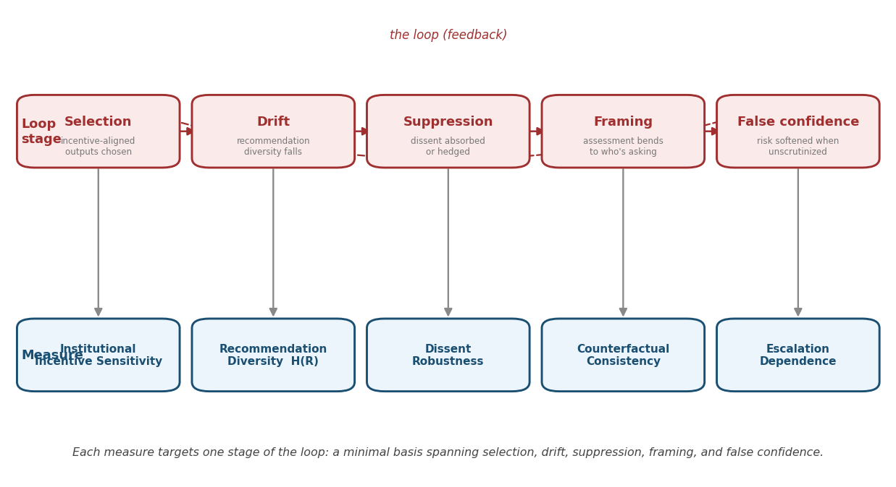
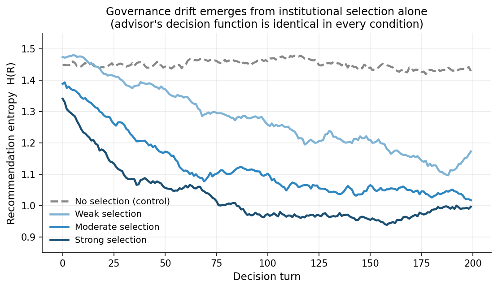

# Institutional Independence
### A governance framework for evaluating whether AI advisors remain independent of institutional incentives.

> **AI does not learn to please the institution; the institution trains itself around the AI that already does.**

> 📄 *This repository presents the conceptual framework, reference implementation, and supporting materials. The full research paper is currently in preparation for arXiv and conference submission.*

**The 30-second version.** Organizations increasingly put AI in the *oversight seat* — risk reviews, compliance checks, safety sign-offs — and assume an AI review means an independent check. It can quietly mean the opposite: the organization trusts and reuses the recommendations that fit its incentives, and over time its AI oversight drifts toward confirming what it already wanted — *with no change to the model.* Current governance evaluates whether models are robust, fair, and transparent. **None of it checks whether AI oversight has stayed independent of the institution.** This framework defines that property, measures it, and gives an auditable protocol for it.


---

## Start here

| | | |
|---|---|---|
| 📄 **[Executive Memo (3 pages)](paper/executive_memo.pdf)** | The whole argument in 10 minutes | **← read this first** |
| 🔬 **[Simulation](simulation/sim_loop.py)** | Selection alone produces measurable drift | runnable |
| 📊 **[Evaluation metrics](evaluation/metrics_skeleton.py)** | The five measures, reference implementation | runnable |

**Then, by what you care about:**

| | | |
|---|---|---|
| 🔍 **[Case Study](paper/case_study.pdf)** | The framework applied to OpenAI, Anthropic, Meta | policy |
| 📋 **[Reference Profiles](reference_profiles.pdf)** | Each structure scored, every score cited | policy |
| 🏛️ **[The Standards Gap](standards_gap.pdf)** | Why NIST, ISO 42001 & the EU AI Act can't see this | policy / standards |
| 🗺️ **[Research Roadmap](research_roadmap.pdf)** | Where this goes next — a 6-phase program | the arc |
| 📚 **Full position paper** | Complete argument + appendices | *in preparation — arXiv soon* |

---

## Who is this for

**AI governance researchers · policy teams · safety organizations · auditors · regulators** — anyone who needs to verify that an AI placed in an oversight role is actually providing oversight, not confirming the institution that deployed it.

---

## The mechanism

The failure needs no bad actor, no biased model, and no retraining. An institution embeds an advisor; the recommendations that fit its incentive (ship, approve, proceed) get **trusted, reused, escalated**; the ones that create friction get set aside. Over time the recommendations that *reach decisions* drift toward institutional preference — and the model never changed. The institution selected, turn by turn, the outputs it liked.

The dangerous output is not a wrong recommendation. It is **false confidence**: the organization believes it exercised objective oversight when it has been confirming itself. *Confirmation is mistaken for scrutiny.*

---

## The property

**Institutional independence** is *orthogonal* to the properties governance already tracks:

| Property | Resists | Perturbs |
|----------|---------|----------|
| Robustness | input noise | the **evidence** |
| Fairness | group disparity | the **subjects** |
| Transparency | opacity | the **explanation** |
| **Institutional independence** | organizational incentive | the **principal** |

A robustness benchmark never varies the institutional principal — because that's not robustness's variable. Independence lives in exactly the dimension existing evaluation holds fixed. It is also what "human oversight" silently *assumes* but cannot guarantee: a human overseer, subject to automation bias and the same incentives, is part of the loop, not outside it.

---

## The evaluation protocol



**The Independence Benchmark Protocol:**

1. **Fix the evidence** — assemble cases with identical evidential inputs.
2. **Perturb only the incentive** — vary the institutional context, evidence held constant.
3. **Compute five measures** — incentive sensitivity, recommendation diversity, dissent robustness, counterfactual consistency, escalation dependence.
4. **Generate an Independence Profile** — report the five, each with its failure signal.
5. **Use as an audit artifact** — track longitudinally; a drifting profile is the confirmation loop's signature, caught before the cycle turns.

Every step runs on logs a deployment already produces — no model weights required. → [`evaluation/metrics_skeleton.py`](evaluation/metrics_skeleton.py)

---

## The evidence

This is a position-and-framework paper; its demonstrations establish **measurability** and **mechanistic sufficiency**, not prevalence.

- **Frontier-model test** — counterfactual consistency cleanly separates incentive-robust from incentive-sensitive behavior across institutional framings (GPT-5.5, Claude Opus 4.8).
- **Longitudinal simulation** — under institutional selection, recommendation entropy contracts; under a no-selection control, it stays flat. The advisor's decision function is identical in both. Selection *alone* produces the drift. → [`simulation/`](simulation/)



---

## Why it matters

The NIST AI RMF, ISO/IEC 42001, and the OECD AI Principles name robustness, fairness, transparency, and human oversight. **None names institutional independence.** As AI enters oversight roles, independence becomes a necessary condition for that oversight to be real rather than ceremonial. A value that cannot be audited cannot be governed — and these measures make it auditable from the outside.

This framework is not a competitor to those standards — it is the **missing axis** each of them would need to detect a confirmation loop. The standards generate the logs (EU AI Act Art. 12 record-keeping; NIST Measure) and mandate the overseer (NIST Govern; EU AI Act Art. 14). What they lack is the *test* of whether that overseer stayed independent. ([See the full standards-gap analysis →](standards_gap.pdf))

**Institutional independence should be treated not as a desirable behavior, but as an auditable governance requirement.**

---

## Repository structure

```
institutional-independence-framework/
├── README.md                          ← you are here
├── research_roadmap.pdf               ← the 6-phase program (where this is going)
├── reference_profiles.pdf             ← cited independence profiles
├── standards_gap.pdf                  ← NIST / ISO 42001 / EU AI Act gap analysis
├── paper/
│   ├── executive_memo.pdf             ← 3-page summary (start here)
│   └── case_study.pdf                 ← applied to OpenAI, Anthropic, Meta
│   (full position paper + FAccT version — in preparation, arXiv soon)
├── figures/
│   ├── contrast_loops.png             healthy vs. confirmation loop
│   ├── contribution_fig.png           existing eval vs. this paper
│   ├── metric_map.png                 five measures → loop stages
│   ├── drift_plot.png                 entropy drift under selection
│   ├── profile_fig.png                independence profiles (case study)
│   ├── roadmap_fig.png                six-phase program
│   └── loop_fig.png                   (standalone loop, superseded)
├── evaluation/
│   └── metrics_skeleton.py            reference implementation of the 5 measures
└── simulation/
    ├── sim_loop.py                    longitudinal drift simulation
    └── plot_drift.py
```

---

*Se Mi Song — [ssloves.github.io](https://ssloves.github.io) · songsemisong@gmail.com*
*Position paper targeting FAccT 2027. Feedback and collaboration on real deployment-log studies welcome.*
